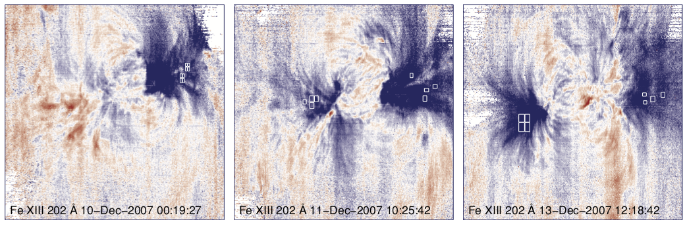
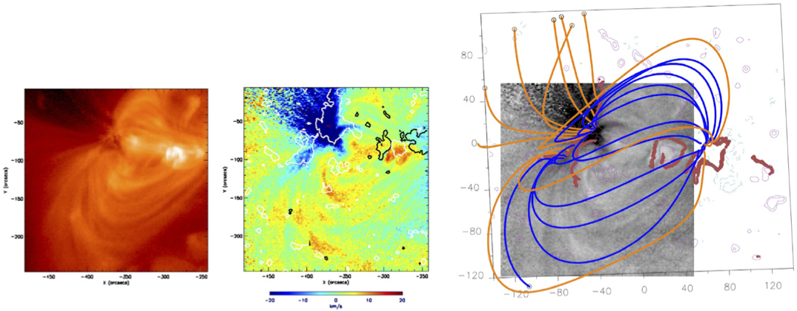

# Signatures of Time-dependent Heating in Active Regions and the Slow Solar Wind
Tuesday, 31 July, 2--5 PM, Seaoats Room (Hilton)

<figure>
  
  <figcaption>Brooks and Warren (2011)</figcaption>
</figure>
<figure>
  
  <figcaption>Baker et al. (2009)</figcaption>
</figure>

## Scene-setting Speakers

* **Vanessa Polito**, *Lockheed-Martin Solar Astrophysics Laboratory*
* **Sue Lepri**, *University of Michigan*

## Organizers

* **Stephen Bradshaw**, *Rice University*
* **Will Barnes**, *Rice University*
* **Nicki Viall**, *Goddard Space Flight Center*